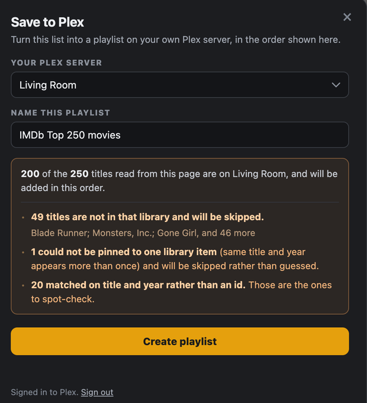

# PlexList

[](https://github.com/afxjzs/plexlist/actions/workflows/test.yml)
[](LICENSE)

A Chrome extension that turns an IMDb or Letterboxd list into a playlist on your
own Plex server, in the order the list shows.

<p align="center">
  
</p>

Open a supported page, click **Save to Plex**, approve access once, pick a
server, and create the playlist. Nothing leaves your machine except requests to
plex.tv and your own server — there is no backend.

## Supported pages

| Site | Pages | Verified against |
|---|---|---|
| IMDb | `/chart/<name>/` | `imdb.com/chart/top/` — 250 titles |
| IMDb | `/list/ls…/` | `imdb.com/list/ls068082370/` — 250 titles |
| Letterboxd | `/…/list/…/` | `letterboxd.com/arinbicer/list/mcu/` — 60 films |
| Letterboxd | `/…/list/…/` (paginated) | `letterboxd.com/official/list/letterboxds-top-500-films/` — 500 films across 5 pages |

## Install

1. `chrome://extensions`
2. Turn on **Developer mode**
3. **Load unpacked** → pick this directory

### Permissions, and the one you may need to add

Installed, it asks only for `plex.tv` and `*.plex.direct`. That covers Plex
accounts reachable over the internet.

If your server is only on your LAN, open the extension's details and set **Site
access** to **On all sites**. Without it Chrome blocks the request to a private
address and the panel says so explicitly rather than reporting a mysterious
network error. This is declared as an *optional* permission so the default
install stays narrow.

## How it works

```
content script            service worker
──────────────            ──────────────
extract.js   reads the list off the page      plex.js       talks to Plex
content.js   renders the dialog               background.js orchestrates, owns the token
```

The content script never sees your Plex token, and the service worker never
touches IMDb or Letterboxd.

Three decisions worth knowing:

**Reading the page rather than fetching it.** IMDb blocks automated fetches:
`curl` gets HTTP 202 with an empty body and headless Chromium gets 403 with a
49-byte document (both measured 2026-08-20). A content script in your own
logged-in browser reads a page that is already rendered, so there is nothing to
work around.

**Matching on ids, not titles.** Plex returns external ids for a whole library in
one request (`?includeGuids=1`), so an IMDb id is an exact lookup. Titles are
not: measured against a real library, number-matching scored 50/50 where exact
title matching scored 47/50, and the misses were apostrophes and part numbering,
not near-misses. Title matching quietly drops items, which is the worst failure
mode because the playlist still looks fine.

Letterboxd list pages carry no ids at all, so films are first matched on title +
year, and anything that misses or comes back ambiguous has its real TMDB/IMDb id
read off its film page and is matched again properly. The panel reports how many
were matched by title rather than by id so you know what to spot-check.

**Saying what will actually land, before it lands.** The panel shows how many of
the list's titles are on the chosen server and names the ones that will be
skipped. Anything ambiguous is skipped rather than guessed, and after creating,
the playlist is read back and its length and order compared against what was
sent.

## Privacy

No backend, no account, no analytics. Your Plex token is stored with
`chrome.storage.local` on your machine and sent only to Plex, as a header rather
than in a URL. The only hosts ever contacted are `plex.tv`, your own Plex server,
and the site whose page you already have open. Full detail in
[PRIVACY.md](PRIVACY.md).

## Tests

```bash
npm test                      # matcher unit tests, no network
npm run check:imdb-chart      # live extractor check
npm run check:imdb-list
npm run check:letterboxd
npm run check:letterboxd-paged
npm run smoke:imdb            # drives the real dialog against a stubbed chrome.*
npm run smoke:letterboxd
```

The live checks drive gstack's `browse` in **headed** mode on purpose — headless
Chromium gets a 403 from IMDb, so a headless run would report a false failure.
They assert item count, strict ordering, id shape, absence of duplicates, and
that IMDb is still being read from `__NEXT_DATA__` rather than the weaker JSON-LD
fallback.

## Packaging for the Chrome Web Store

```bash
icons/build.sh        # regenerate PNGs from icons/icon.svg (needs librsvg)
tools/package.sh      # -> dist/plexlist-<version>.zip
```

The zip contains only `manifest.json`, `src/`, the four icon PNGs and `LICENSE`.
Tests, docs and repo furniture are left out. `package.sh` refuses to build if an
icon is missing or older than the SVG it came from, and if `manifest.json` does
not parse.

Store listing needs: the 128px icon, a privacy policy URL ([PRIVACY.md](PRIVACY.md)),
and a justification for each permission — the table in that file is written to be
pasted into the review form.

## Verified, and not

Verified against live pages and a live Plex server on 2026-08-20:

- Plex library + external ids in one request; order preserved on playlist
  creation; per-server `accessToken` required for shared servers; connection
  racing; read-back after create. (Details in `LEARNINGS.md`.)
- IMDb `__NEXT_DATA__` shapes for both chart and list pages, and that a
  same-origin `fetch` from the page context returns parseable page data.
- Letterboxd list markup, its global `data-list-index`, its `a.next` pagination,
  and `data-tmdb-id` / IMDb link on film pages.

- **The full Plex sign-in handshake**, confirmed end to end on 2026-08-21:
  request a PIN, approve it on app.plex.tv, receive the token, list servers, and
  read a library. Confirmed against more than one server on the account.
- **Reaching a Plex server that has no remote access**, same date. Chrome blocks a
  web page from reaching a private address outright; the extension is not blocked.
  That is the whole reason this is an extension and not a web page — it works for
  people whose Plex is not exposed to the internet.

**Not yet verified:**

1. **IMDb pagination past 250 items.** Every list tested fit on one page, so
   `?page=N` is assumed, not confirmed. The extractor does not trust it: each
   fetched page must produce new titles, and if it does not, reading stops and
   the panel says only the first N could be read rather than silently building a
   short or duplicate-filled playlist.

## Files

```
manifest.json        MV3 manifest
src/extract.js       IMDb + Letterboxd list extraction (content script)
src/content.js       the dialog (content script)
src/plex.js          Plex API client (module, service worker)
src/background.js    orchestration, token ownership (service worker)
test/match-test.mjs  matcher unit tests
test/extract-check.js + run-extract-check.sh   live extractor check
LEARNINGS.md         the Plex and IMDb findings this was built from
```
